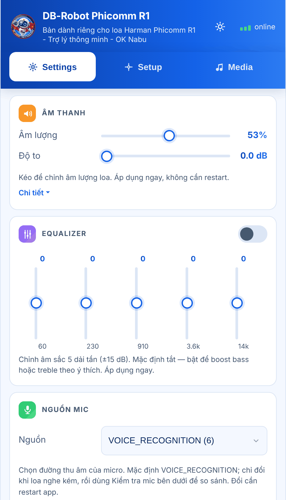
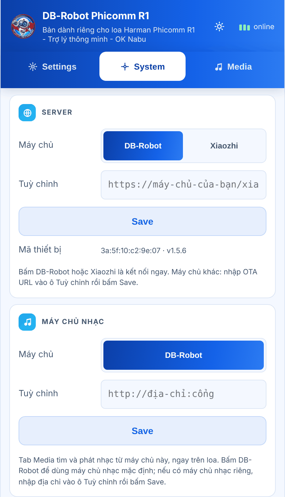
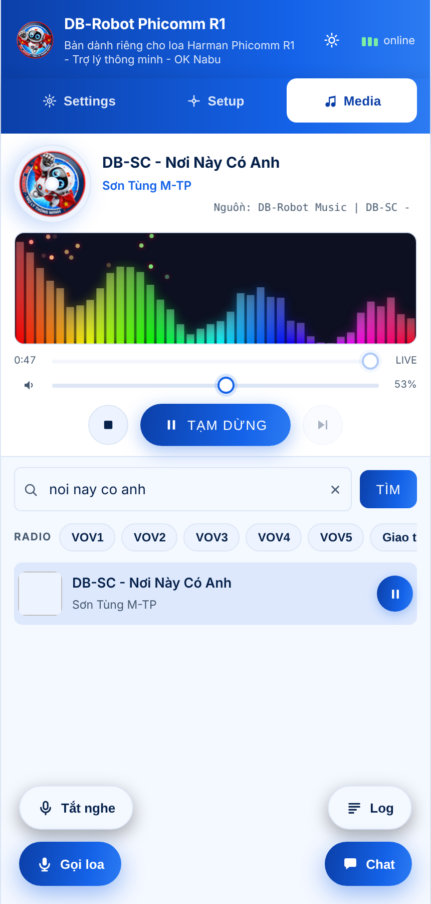
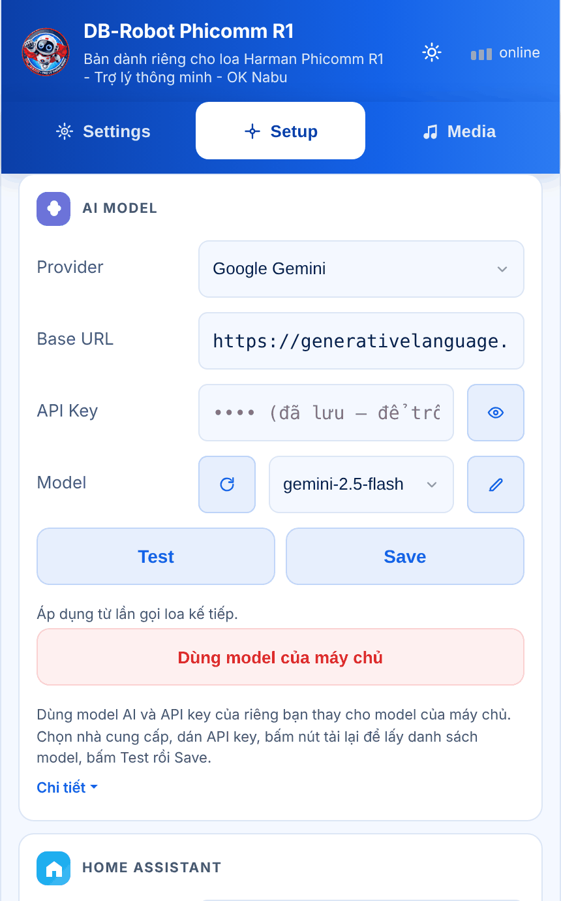
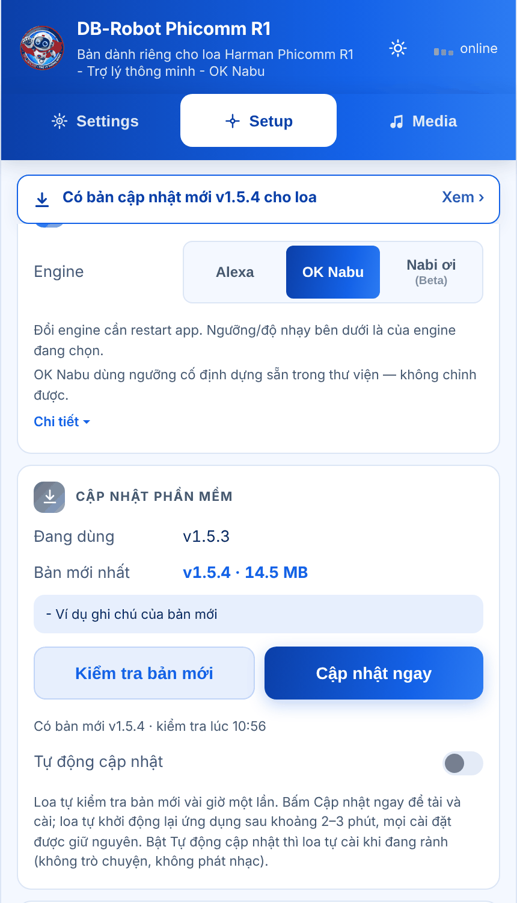
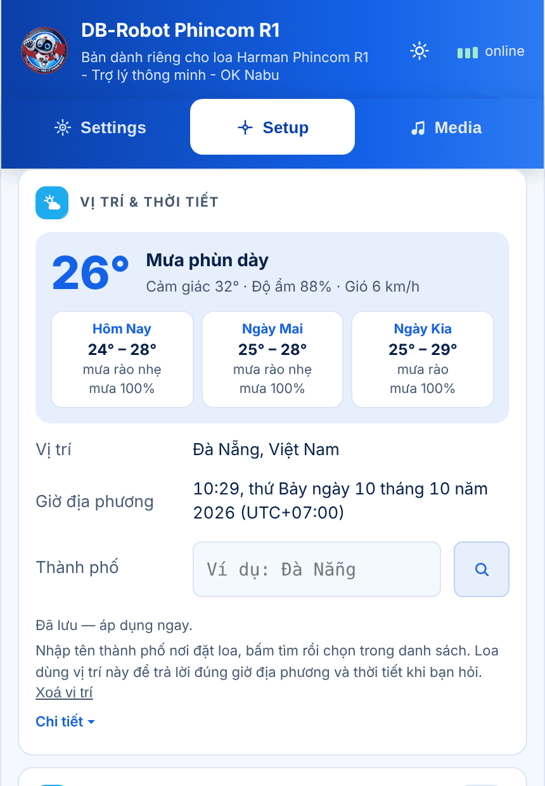
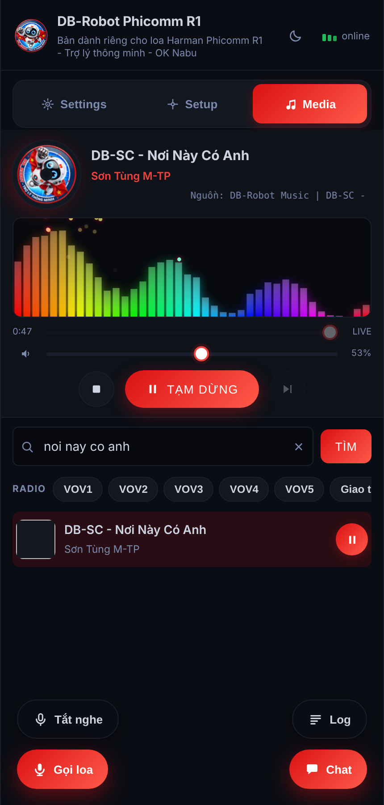
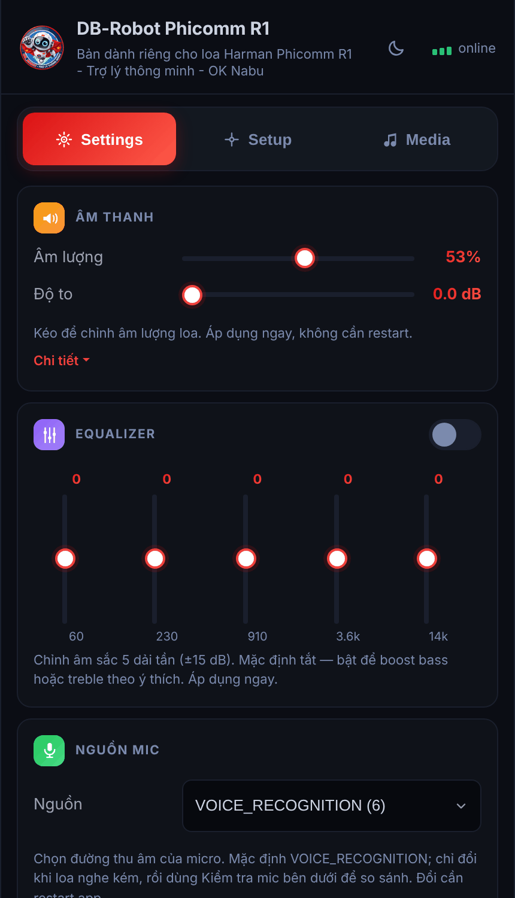

<p align="center">
  
</p>

<h1 align="center">DB-Robot Phincom R1</h1>

<p align="center">
  Trợ lý giọng nói thông minh dành riêng cho loa Harman Phincom R1 (Phicomm R1).<br>
  <a href="https://dbrobot.vn/">dbrobot.vn</a> ·
  <a href="https://github.com/ledienbien-ai/db-robot-phincomR1/releases/latest">Tải bản mới nhất</a> ·
  <a href="install/HUONG_DAN_CAI_DAT.md">Hướng dẫn cài đặt</a>
</p>

---

DB-Robot biến chiếc loa Phincom R1 thành trợ lý ảo nói tiếng Việt: gọi **"OK Nabu"**, hỏi bất cứ
điều gì, nghe nhạc, điều khiển nhà thông minh. Loa chỉ thu âm, nhận từ đánh thức và phát tiếng;
việc nhận dạng giọng nói, suy nghĩ và tổng hợp giọng đọc do máy chủ đảm nhiệm, nên loa đời cũ
(Android 5.1) vẫn chạy mượt.

Mọi thứ được cài đặt và điều khiển từ trình duyệt trên điện thoại hoặc máy tính — loa không cần
màn hình.

## Tính năng

- **Trò chuyện bằng giọng nói** — gọi "OK Nabu" (hoặc "Alexa", "Nabi ơi") rồi nói. Bấm nút trên
  đỉnh loa cũng đánh thức được; bấm lần nữa để ngắt lời hoặc cho loa nghỉ.
- **Trang điều khiển ngay trên loa** — mở `http://<IP-của-loa>:8088` từ bất kỳ thiết bị nào cùng
  mạng Wi-Fi. Có giao diện sáng (xanh, đồng bộ với dbrobot.vn) và tối.
- **Nghe nhạc** — tìm bài hát và phát ngay trên loa, có quang phổ theo nhạc, thanh âm lượng, nút
  phát / tạm dừng / bài kế. Nhạc tự tạm dừng khi bạn nói chuyện với loa và phát tiếp sau đó.
- **Chọn máy chủ bằng một nút bấm** — máy chủ DB-Robot hoặc Xiaozhi có sẵn, và ô nhập cho máy chủ
  riêng. Mã kích hoạt hiện ngay trên trang.
- **Dùng model AI của riêng bạn** — nhập API key của OpenAI, Google Gemini, OpenRouter, DeepSeek,
  Groq… và chọn model (cần máy chủ hỗ trợ, xem [bên dưới](#model-ai-riêng)).
- **Đúng giờ, đúng thời tiết nơi bạn ở** — nhập thành phố một lần; hỏi "mấy giờ rồi", "thời tiết
  hôm nay thế nào" là trợ lý trả lời theo nơi đặt loa (cần máy chủ hỗ trợ, xem
  [bên dưới](#vị-trí-và-thời-tiết)).
- **Tự cập nhật qua mạng (OTA)** — loa tự kiểm tra bản mới; cập nhật bằng một nút bấm, hoặc bật
  tự động.
- **Phát ra loa Bluetooth** — ghép đôi loa hoặc tai nghe ngoài và phát mọi âm thanh ra đó.
- **Chỉnh âm thanh** — âm lượng, độ to, equalizer 5 dải, khuếch đại micro cho người nói từ xa,
  thu thử micro để nghe lại.
- **Đèn LED** — vòng đèn của loa đổi hiệu ứng theo trạng thái: đang nghe, đang trả lời, phát nhạc.
- **Home Assistant** — chọn thiết bị nhà thông minh để trợ lý điều khiển (cần máy chủ hỗ trợ).
- **Tự chạy khi cắm điện**, kèm khung chat và nhật ký hoạt động ngay trên trang điều khiển.

## Hình ảnh

<table>
  <tr>
    <td align="center"><br><b>Settings</b> — âm thanh, micro, đèn</td>
    <td align="center"><br><b>Setup</b> — máy chủ, máy chủ nhạc</td>
    <td align="center"><br><b>Media</b> — trình phát nhạc</td>
  </tr>
  <tr>
    <td align="center"><br><b>AI Model</b> — dùng API key riêng</td>
    <td align="center"><br><b>Cập nhật</b> — thông báo và nút cập nhật</td>
    <td align="center"><br><b>Vị trí &amp; thời tiết</b></td>
  </tr>
  <tr>
    <td align="center"><br><b>Giao diện tối</b></td>
    <td align="center"><br><b>Settings</b> — giao diện tối</td>
    <td></td>
  </tr>
</table>

## Cài đặt vào loa

Cần loa R1 đã vào Wi-Fi nhà bạn và một máy tính hoặc điện thoại Android cùng mạng. Chỉ phải cài
bằng cách này một lần; các bản sau cập nhật ngay trên trang điều khiển.

| Thiết bị | Cách cài |
|---|---|
| **Windows** | Tải [DB-Robot-R1-Windows.zip](https://github.com/ledienbien-ai/db-robot-phincomR1/releases/latest/download/DB-Robot-R1-Windows.zip), giải nén, bấm đúp `Cai-dat-DB-Robot.bat` |
| **Điện thoại Android** | Cài [Termux](https://f-droid.org/packages/com.termux/), dán lệnh bên dưới |
| **macOS, Linux** | Mở Terminal, dán lệnh bên dưới |

```
curl -fsSL https://github.com/ledienbien-ai/db-robot-phincomR1/releases/latest/download/install.sh | bash
```

Bộ cài tự tìm loa trong mạng, tải bản mới nhất và cài đặt (khoảng 2–3 phút). Hướng dẫn từng bước
và cách xử lý trục trặc: [install/HUONG_DAN_CAI_DAT.md](install/HUONG_DAN_CAI_DAT.md).

## Bắt đầu sử dụng

1. Mở `http://<IP-của-loa>:8088` trên trình duyệt.
2. Vào tab **Setup** → thẻ **Server** → bấm **DB-Robot**.
3. Nếu loa chưa được kích hoạt, mã kích hoạt hiện ngay bên dưới — nhập mã đó trên trang quản lý
   của máy chủ.
4. Trong thẻ **Vị trí & thời tiết**, nhập thành phố của bạn và chọn trong danh sách.
5. Gọi **"OK Nabu"** và bắt đầu trò chuyện.

### Trang điều khiển

| Tab | Có gì |
|---|---|
| **Settings** | Âm lượng và độ to · Equalizer · Nguồn mic · Khuếch đại mic (AGC) · Kiểm tra mic · Đèn LED · Định dạng âm thanh |
| **Setup** | Server · Máy chủ nhạc · Vị trí & thời tiết · Bluetooth · AI Model · Home Assistant · Wake word · Cập nhật phần mềm · Khởi động lại ứng dụng |
| **Media** | Trình phát nhạc, quang phổ, âm lượng, ô tìm bài hát |

Hai nút nổi ở góc dưới mở khung **Chat** (gõ chữ thay cho nói, xem lại hội thoại) và **Log** (nhật
ký hoạt động của loa). Mỗi thẻ có dòng mô tả ngắn và mục **Chi tiết** giải thích cách chỉnh.

### Từ đánh thức

| Tên | Ghi chú |
|---|---|
| **OK Nabu** (mặc định) | Ổn định, không cần chỉnh |
| **Alexa** | Chỉnh được độ nhạy, riêng cho lúc yên lặng và lúc loa đang phát tiếng |
| **Nabi ơi** (thử nghiệm) | Chỉnh được ngưỡng |

Đổi từ đánh thức trong tab Setup → **Wake word**, rồi khởi động lại ứng dụng.

## Máy chủ

DB-Robot nói chuyện với máy chủ theo giao thức [xiaozhi](https://github.com/78/xiaozhi-esp32). Thẻ
**Server** có ba lựa chọn:

| Máy chủ | Địa chỉ OTA | Âm thanh |
|---|---|---|
| **DB-Robot** (mặc định) | `https://sv1.dbrobot.vn/xiaozhi/ota/` | 16 kHz mono |
| **Xiaozhi** | `https://api.tenclass.net/xiaozhi/ota/` | 24 kHz mono |
| **Tuỳ chỉnh** | OTA URL của máy chủ xiaozhi-esp32-server của bạn | chỉnh ở tab Settings → Hệ thống |

Bấm một trong hai máy chủ có sẵn là kết nối ngay và loa tự đặt đúng định dạng âm thanh. Với máy chủ
tuỳ chỉnh, tốc độ lấy mẫu và số kênh ở tab Settings phải khớp với định dạng máy chủ gửi về; trang
điều khiển hiện cảnh báo đỏ khi hai bên lệch nhau.

### Model AI riêng

Thẻ **AI Model** cho phép dùng model và API key của chính bạn thay cho model của máy chủ. Chọn nhà
cung cấp (hoặc nhập địa chỉ tương thích OpenAI), dán API key, tải danh sách model, bấm **Test** để
kiểm tra rồi **Save**.

- Nút **Test** gọi thẳng nhà cung cấp từ loa, nên kiểm tra được key và model mà không cần máy chủ.
- Khi trò chuyện, loa gửi cấu hình này (trường `llm_config` trong gói `hello`, gồm cả API key) cho
  máy chủ đang kết nối. **Máy chủ phải đọc trường này thì model của bạn mới được dùng**; máy chủ
  xiaozhi-esp32-server nguyên bản bỏ qua nó.
- Loa không gửi API key hay token Home Assistant cho máy chủ Xiaozhi công cộng.
- **Dùng model của máy chủ** xoá cấu hình và key đã lưu trên loa.

Thẻ **Home Assistant** hoạt động theo cùng cách (trường `ha_config`).

## Vị trí và thời tiết

Máy chủ không biết loa của bạn đặt ở đâu, nên khi được hỏi giờ nó trả lời theo đồng hồ của chính
nó — có thể lệch múi giờ. Thẻ **Vị trí & thời tiết** trong tab Setup khắc phục việc đó: nhập tên
thành phố, chọn đúng nơi trong danh sách, loa lưu toạ độ và múi giờ rồi tự lấy thời tiết (từ
[Open-Meteo](https://open-meteo.com/), không cần API key).

Loa đưa thông tin này cho trợ lý qua hai công cụ MCP trên thiết bị:

| Công cụ | Trả về |
|---|---|
| `self.get_local_time` | Ngày giờ địa phương tại nơi đặt loa, kèm múi giờ |
| `self.get_weather` | Thời tiết hiện tại và dự báo 3 ngày tại nơi đặt loa, hoặc tại thành phố được hỏi (tham số `city`) |

Máy chủ phải hỗ trợ MCP trên thiết bị (loa khai báo `"features":{"mcp":true}` trong gói `hello`);
các bản xiaozhi-esp32-server gần đây có sẵn tính năng này. Chưa chọn thành phố thì loa dùng múi
giờ Việt Nam và chưa có thời tiết.

## Máy chủ nhạc

Tab Media phát nhạc từ một máy chủ nhạc qua HTTP. Mặc định là `https://ms.dbrobot.vn`; thẻ **Máy
chủ nhạc** trong tab Setup có ô nhập cho máy chủ riêng. Máy chủ cần hai địa chỉ:

| Địa chỉ | Trả về |
|---|---|
| `GET /stream_pcm?song=<tên bài>` | JSON `{"success":true,"title":…,"artist":…,"thumbnail":…,"audio_url":"/stream_mp3?id=…"}` |
| `GET <audio_url>` | Luồng MP3 của bài hát |

Loa tự giải mã và phát MP3, nên nhạc không đi qua đường thoại của trợ lý.

## Cập nhật phần mềm

Loa đọc tệp `update.json` của bản phát hành mới nhất trên GitHub vài giờ một lần. Khi có bản mới,
trang điều khiển hiện thông báo ở đầu trang; vào tab Setup → **Cập nhật phần mềm** → **Cập nhật
ngay**. Loa tải bản mới, đối chiếu mã SHA-256, cài đặt rồi tự chạy lại sau 2–3 phút; mọi cài đặt
được giữ nguyên. Bật **Tự động cập nhật** thì loa tự cài khi đang rảnh (không trò chuyện, không
phát nhạc).

## Dành cho nhà phát triển

### Build

GitHub Actions build APK mỗi lần đẩy lên `main` (tải ở mục *Artifacts* của lần chạy). Build trên
máy cần JDK 17, Android SDK 35, NDK 27 và CMake 3.22.1:

```
./gradlew :app:assembleRelease
```

Bản release là bản để chạy trên loa (đã tối ưu bằng R8). `applicationId` là `vn.dbrobot.r1`,
`minSdk` 22.

### Cấu trúc mã nguồn

| Đường dẫn | Nội dung |
|---|---|
| `app/src/main/assets/control.html` | Toàn bộ trang điều khiển (một tệp, không dùng framework) |
| `…/voicebot/control/ControlServer.kt` | Máy chủ web trên loa (cổng 8088) và các địa chỉ `/api/*` |
| `…/voicebot/data/AppConfig.kt`, `Settings.kt` | Giá trị mặc định và cài đặt lưu trên loa |
| `…/voicebot/data/ServerProvisioner.kt` | Hỏi OTA, lấy địa chỉ WebSocket và mã kích hoạt |
| `…/voicebot/protocol/WebsocketProtocol.kt` | Kết nối tới máy chủ xiaozhi |
| `…/voicebot/domain/voice/VoiceAssistant.kt` | Vòng đời đánh thức → nghe → trả lời |
| `…/voicebot/data/voice/` | Từ đánh thức, thu âm, phát âm, đèn LED |
| `…/voicebot/media/LocalMusicPlayer.kt` | Phát nhạc từ máy chủ nhạc, lấy quang phổ |
| `…/voicebot/weather/` | Vị trí, múi giờ, thời tiết (`Weather.java`, `LocationManager.kt`) |
| `…/voicebot/mcp/` | Công cụ MCP cho trợ lý (`DeviceMcp.java`, `DeviceTools.kt`) |
| `…/voicebot/update/` | Tự cập nhật: `Updater.java`, `AdbLoopback.java`, `UpdateManager.kt` |
| `install/` | Bộ cài cho người dùng và script đóng gói bản phát hành |
| `.github/workflows/build-apk.yml` | Build và phát hành |

(`…/voicebot` là `app/src/main/java/info/dourok/voicebot`.)

### Phát hành bản mới

1. Tăng `versionCode` **và** `versionName` trong `app/build.gradle.kts`; thêm mục
   `## v<versionName>` vào `RELEASE_NOTES.md`.
2. Đẩy lên `main` và chờ build xong.
3. `git tag v<versionName>` rồi `git push origin v<versionName>` (hoặc bấm *Run workflow* và tích
   *Phát hành*). Workflow gắn APK, `update.json` và bộ cài vào một GitHub Release; các loa thấy bản
   mới trong vòng vài giờ.

Khoá ký APK (`app/dbrobot.keystore`) nằm công khai trong repo để bản nào cũng cài đè được lên bản
nào, nên chữ ký không chứng minh APK do ai làm ra. Thứ bảo vệ đường cập nhật là `update.json` chỉ
được tải qua https từ repo này, kèm SHA-256 của APK — đừng đổi `AppConfig.UPDATE_URL` sang http.

## Ghi công và nguồn

DB-Robot Phincom R1 được phát triển từ các dự án nguồn mở sau; xin cảm ơn các tác giả.

- [kuteo-git/xiaozhi-android](https://github.com/kuteo-git/xiaozhi-android) — bản xiaozhi cho loa
  R1 mà dự án này kế thừa trực tiếp: kiến trúc ứng dụng, trang điều khiển, ba engine từ đánh thức,
  nút cứng, đèn LED, Bluetooth.
- [douo/xiaozhi-android](https://github.com/douo/xiaozhi-android) — ứng dụng xiaozhi cho Android
  mà bản trên phát triển từ đó.
- [78/xiaozhi-esp32](https://github.com/78/xiaozhi-esp32) và
  [xinnan-tech/xiaozhi-esp32-server](https://github.com/xinnan-tech/xiaozhi-esp32-server) — giao
  thức và máy chủ xiaozhi.
- [Snowboy](https://github.com/Kitt-AI/snowboy) (từ đánh thức "Alexa") và
  [microWakeWord](https://github.com/kahrendt/microWakeWord) (từ đánh thức "OK Nabu"). Thư viện
  `libmicro_wake_word_jni.so` của "OK Nabu" là bản dựng sẵn đi kèm mã nguồn kuteo-git, có nguồn gốc
  từ ứng dụng AI Box Plus.
- [Open-Meteo](https://open-meteo.com/) — dữ liệu thời tiết và tìm địa danh (miễn phí cho mục đích
  phi thương mại).
- [Opus](https://opus-codec.org/), [OkHttp](https://square.github.io/okhttp/),
  [NanoHTTPD](https://github.com/NanoHttpd/nanohttpd), [TensorFlow Lite](https://www.tensorflow.org/lite).

Tại thời điểm viết, kho mã kuteo-git/xiaozhi-android không kèm tệp giấy phép. Phần mã do DB-Robot
viết thêm nằm trong kho này; các phần kế thừa thuộc về tác giả của chúng.
